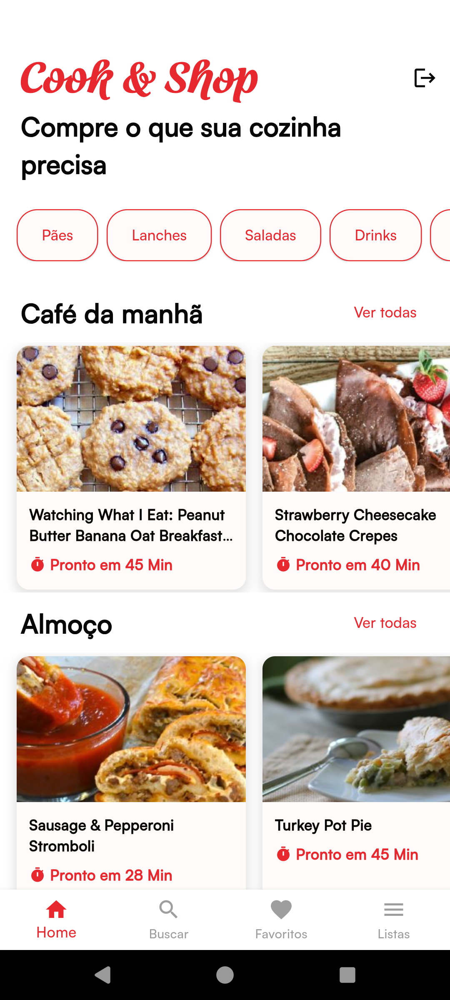
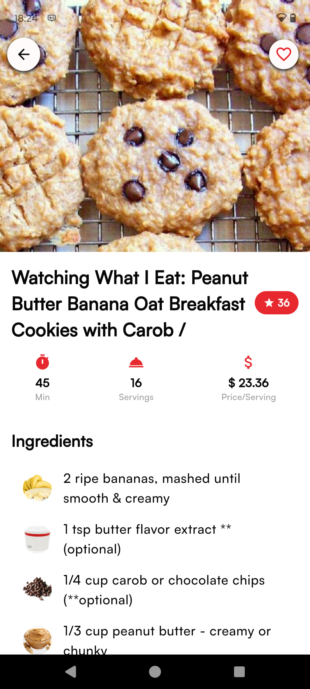
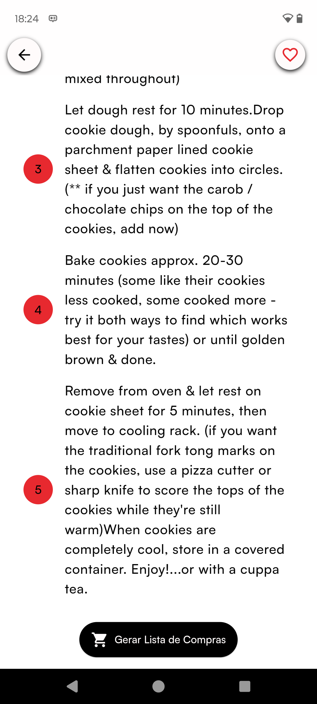
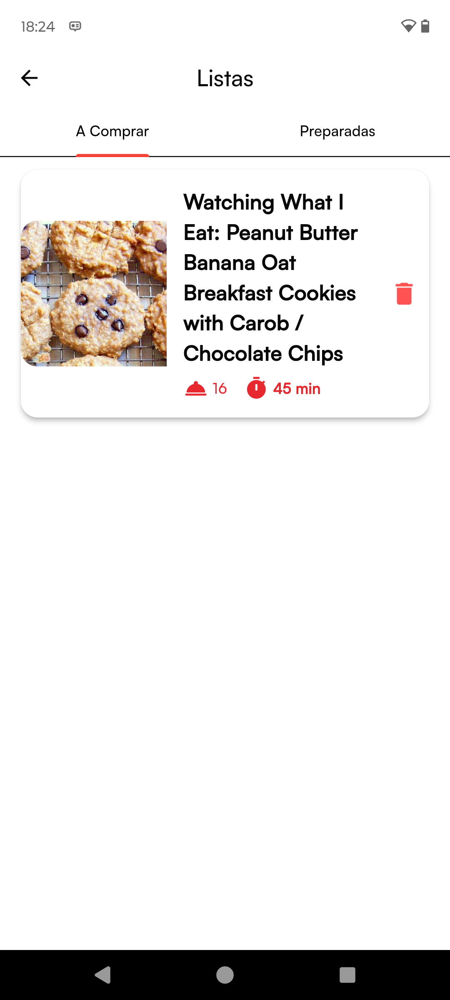
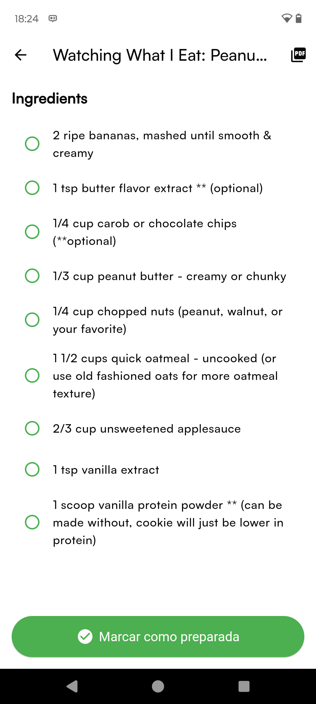
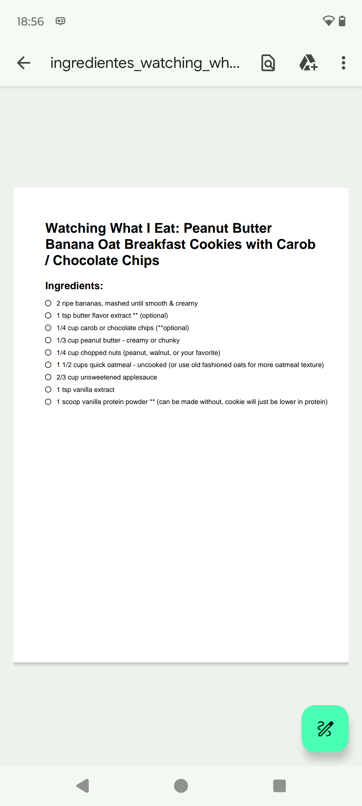
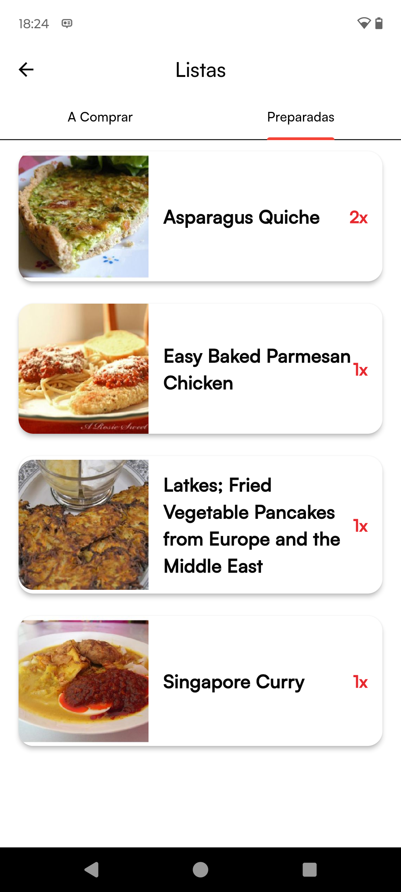
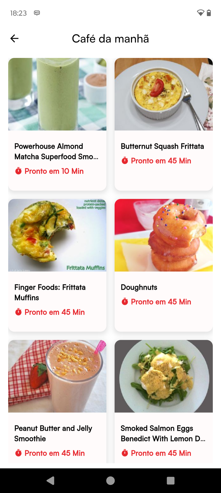
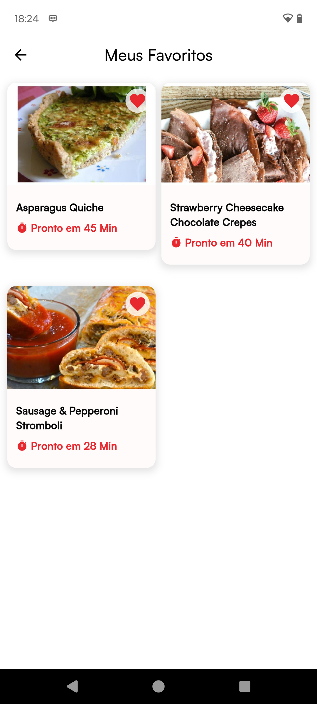

[FLUTTER_BADGE]: https://img.shields.io/badge/Flutter-02569B?style=flat&logo=flutter&logoColor=white
[FIREBASE]: https://img.shields.io/badge/Firebase-FFCA28?style=flat&logo=Firebase&logoColor=white
[API]: https://img.shields.io/badge/API-REST%20%26%20Spoonacular-4CAF50?style=flat

<h1 align="center" style="font-weight: bold">Cook & Shop 🛒🍽️</h1>

![flutter][FLUTTER_BADGE]
![firebase][FIREBASE]
![api][API]

    <strong>Cook&Shop</strong> é um aplicativo que reúne receitas culinárias organizadas por categorias e permite 
    aos usuários criarem <strong>listas de compras automatizadas</strong> com base nos ingredientes das receitas escolhidas. 
    O app facilita o planejamento de refeições e a organização da cozinha, oferecendo uma experiência prática e intuitiva.

  
  
  

  
  
  

  
  
  

<h2>🚀 Tecnologias Utilizadas</h2>

<h3>📱 Mobile</h3>
<ul>
    <li><strong>Flutter</strong>: Framework para o desenvolvimento da aplicação mobile.</li>
</ul>

<h3>🔥 Backend & Banco de Dados</h3>
<ul>
    <li><strong>Firebase Realtime Database</strong>: Armazena e sincroniza receitas e listas de compras em tempo real.</li>
    <li><strong>Firebase Auth</strong>: Gerenciamento seguro de autenticação de usuários.</li>
</ul>

<h3>🔗 APIs Externas</h3>
<ul>
   <li><strong><a href="https://spoonacular.com/food-api" target="_blank">Spoonacular</a></strong>: Plataforma para busca de receitas online e informações nutricionais.</li>
</ul>

<h2>📌 Funcionalidades</h2>
<ul>
    <li>✅ <strong>Busca de Receitas</strong>: Filtro avançado por ingredientes disponíveis, tempo de preparo e nível de dificuldade.</li>
    <li>✅ <strong>Lista de Compras Inteligente</strong>: Geração automática da lista de compras com base nas receitas escolhidas.</li>
    <li>✅ <strong>Favoritos e Histórico</strong>: Salve receitas favoritas e acompanhe o histórico de pratos preparados.</li>
    <li>✅ <strong>PDF</strong>: Salve ou compartilhe PDF das listas de compras geradas.</li>
    <li>✅ <strong>Notificações</strong>: Receba lembretes sobre listas de compras e receitas salvas.</li>
</ul>

<h2>🛠️ Como Executar</h2>

<h3>📱 1. Aplicativo Flutter</h3>
<ul>
    <li>Clone o repositório:</li>
    <pre><code>git clone https://github.com/im-fernanda/cook-and-shop.git
cd cook-and-shop</code></pre>
    <li>Instale as dependências do Flutter:</li>
    <pre><code>flutter pub get</code></pre>
    <li>Execute o aplicativo:</li>
    <pre><code>flutter run</code></pre>
</ul>

<h3>🔥 2. Firebase</h3>
<ul>
    <li>Crie um projeto no Firebase.</li>
    <li>Ative os seguintes serviços:</li>
    <ul>
        <li>✅ Realtime Database</li>
        <li>✅ Firebase Auth</li>
    </ul>
    <li>Baixe as credenciais do Firebase e configure-as no seu aplicativo Flutter.</li>
</ul>

<h3>🔗 3. API Externa</h3>
<ul>
    <li>Crie uma conta na e obtenha sua chave de API.</li>
    <li>Adicione a chave de API ao seu projeto para realizar buscas de receitas.</li>
</ul>
